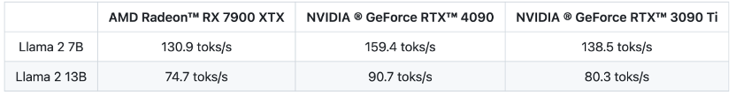
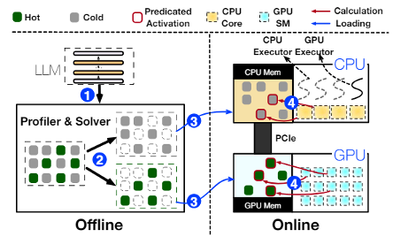
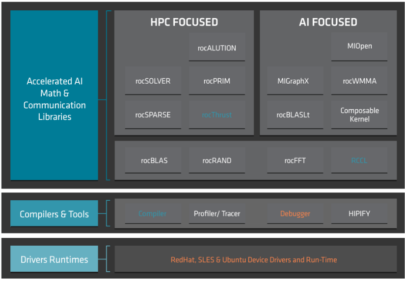

# 竞赛题目

## 赛题介绍

近年来，随着大型语言模型（LLM）的兴起，其在自然语言处理任务中的应用已成为人工智能领域的热点。同时MLC LLM, llama.cpp等项目的出现，旨在提高LLM在消费级显卡甚至个人计算机上的推理速度，降低了大模型部署对硬件资源的需求，使更多人从大模型中获益。例如在CMU 陈天奇团队MLC项目的测试（使用4 bit量化对Llama 2 7B和13B，设置prompt长度为1个token，生成512个 token来测量decoding的性能，batch size=1）：

可以看到在MLC LLM项目中， 不管是NV RTX 还是AMD Radeon 消费级显卡都取得了很不错的推理速度。而llama.cpp是一个相对早期的LLM推理引擎开源项目，其架构设计可以通过CPU/GPU进行混合加速推理任务，甚至可以仅依靠CPU完成推理。然而，随着LLM规模的增大和任务的复杂性，llama.cpp在处理大规模模型时面临内存需求和计算效率方面的挑战。

上海交大IPADS 实验室在2023年12月发布了PowerInfer开源项目，其在llama.cpp基础上采用了一种全新的设计思路，利用LLM推理中的高局部性特征。该局部性具体表现为神经元激活的幂律分布，即少数“热”神经元在不同输入下保持激活，而大多数“冷”神经元根据具体输入变化。PowerInfer充分利用了这一特点，设计了一种GPU-CPU混合推理引擎，通过将热激活的神经元预加载到GPU中，而将冷激活的神经元计算在CPU上，从而显著降低了GPU内存需求和CPU-GPU数据传输。目前该项目也已经在llama2-7B，llama2-13B模型上实现了NV和AMD GPU的支持。 

## **初赛题目**
本次比赛，主要基于PowerInfer的开源项目，要求参赛队在熟悉Llama2-7B/13B的优化方法基础上，利用开源的ROCm开源堆栈和HIP编程模型在Radeon 7900XTX GPU上对13B模型：**[Prosparse-13B](https://huggingface.co/PowerInfer/prosparse-llama-2-13b-gguf)** 展开优化，方法不限(例如算子优化、混合精度量化等)。

---------------------------------------

Copyright&copy; 2024 AMD-Xilinx

